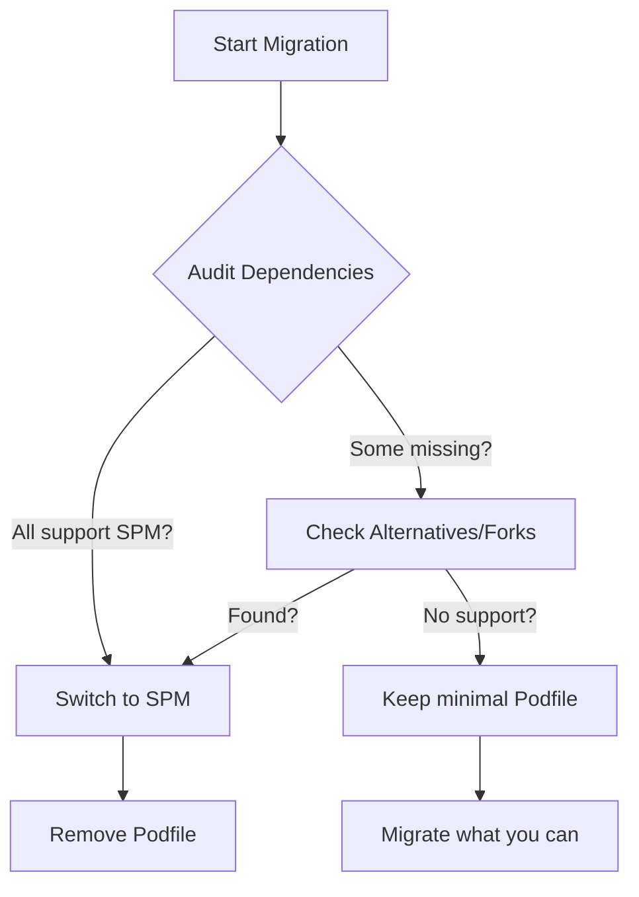

It’s the end of an era for the iOS ecosystem. After 15 years as the de facto dependency manager for iOS, **CocoaPods is retiring**.

Mark your calendar: **December 2, 2026**. That is the day the CocoaPods trunk goes permanently read-only. While existing pods will remain accessible, no new pods or updates can be published. It's time to move on.

## The Legacy of CocoaPods
Before we rush to migrate, it's worth acknowledging what CocoaPods achieved. It brought order to the chaos of manual dependency management (remember dragging `.xcodeproj` files and linking binaries manually?). It democratized open source in the Apple ecosystem. But as Swift has matured, the tooling has evolved.

## Why Move to Swift Package Manager (SPM)?
Apple's official answer to dependency management, Swift Package Manager, has grown up.

1.  **Native Integration:** It's built directly into Xcode. No context switching to terminals or managing a separate workspace.
2.  **No Ruby:** Say goodbye to `rbenv`, `Gemfile`, and Ruby version conflicts that break your CI/CD.
3.  **Performance:** SPM leverages Swift's build system for faster dependency resolution and indexing.


## Migration Strategy: The "Long Way" Home

Migrating a large project isn't just about deleting a file. It requires a strategy.

### Step 1: Audit Your Dependencies
First, list every pod you currently use. Check their repositories to see if they support SPM (most popular ones like Alamofire, Kingfisher, and Lottie already do).



### Step 2: Clean Up CocoaPods
Before adding new packages, you need to strip out the old integration.

1.  **Deintegrate:** Run the following command in your project directory:
    ```bash
    pod deintegrate
    ```
2.  **Clean Files:** Delete `Podfile`, `Podfile.lock`, and the `.xcworkspace`. From now on, you'll open the `.xcodeproj` directly.

### Step 3: Adding Packages in Xcode
This is where the magic happens.

> **Action Required:**
> 1. Open Xcode.
> 2. Go to **File > Add Package Dependencies...**
> 3. Paste the URL of the package repository (e.g., `https://github.com/Alamofire/Alamofire`).
> 4. Choose your version rules (typically "Up to Next Major").

*(Insert Screenshot here: Show the Xcode "Add Package Dependency" dialog with a search result visible)*

### Step 4: Handling Resources and Objective-C
SPM handles resources (images, json, xibs) differently.
- **Bundles:** If you were accessing resources via a specific bundle ID in CocoaPods, you might need to switch to using `Bundle.module` (available automatically in SPM packages).
- **Obj-C Flags:** If you have legacy Objective-C dependencies, ensure you check the "Build Settings" for Linker Flags. SPM usually handles this, but sometimes you may need to add `-ObjC` manually if a comprehensive static library is involved.

## Common Pitfalls
- **Dynamic vs Static:** CocoaPods defaults to static libraries (unless `use_frameworks!` is set). SPM tries to interpret the package manifest. If you get duplicate symbol errors, check if you are linking a static library in multiple targets.
- **CI/CD:** Update your pipeline (`.github/workflows` or Fastlane). You no longer need `pod install`. Instead, add a step to resolve package versions if you cache them:
    ```bash
    xcodebuild -resolvePackageDependencies
    ```

## Conclusion
The deadline is 2026, but the best time to migrate is now. By moving to SPM, you simplify your project capability and align with the future of Apple development.

**Start now. Go slow. And yeah — thanks for everything, CocoaPods!**