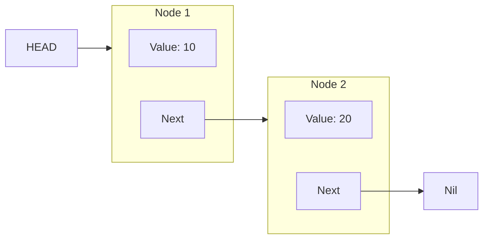
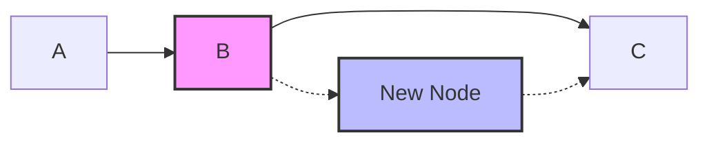

Linked Lists are one of the most fundamental data structures in computer science. While Swift's standard library provides powerful `Array` and `Set` types, understanding Linked Lists is crucial for coding interviews and understanding memory management.

## What is a Linked List?

A **Linked List** is a linear data structure where elements are not stored in contiguous memory locations. Instead, each element (called a **Node**) points to the next one.

### Linked List vs Array

| Feature | Array | Linked List |
| :--- | :--- | :--- |
| **Memory** | Contiguous block | Scattered (connected by pointers) |
| **Insertion/Deletion** | Expensive (Shift elements) | Cheap (Update pointers) |
| **Access** | O(1) Random Access | O(n) Sequential Access |

## Anatomy of a Node
Each node contains two things:
1.  **Value**: The data it holds.
2.  **Next**: A reference to the next node.



## Implementation in Swift

Let's build a Generic Node class.

```swift
class Node<T> {
    var value: T
    var next: Node?

    init(value: T) {
        self.value = value
    }
}
```

Now, the `LinkedList` class to manage the nodes.

```swift
struct LinkedList<T> {
    var head: Node<T>?
    var tail: Node<T>?

    var isEmpty: Bool {
        return head == nil
    }

    // 1. Append (Add to end) - O(1) thanks to tail pointer
    mutating func append(_ value: T) {
        let newNode = Node(value: value)
        if let tailNode = tail {
            tailNode.next = newNode
        } else {
            head = newNode
        }
        tail = newNode
    }
    
    // 2. Prepend (Add to start) - O(1)
    mutating func prepend(_ value: T) {
        let newNode = Node(value: value)
        newNode.next = head
        head = newNode
        if tail == nil {
            tail = head
        }
    }
}
```

## Advanced Operations

### Inserting at a Specific Index
To insert into the middle, we must traverse the list to find the node *before* the target index.



```swift
    mutating func insert(_ value: T, after node: Node<T>) {
        let newNode = Node(value: value)
        newNode.next = node.next
        node.next = newNode
        if newNode.next == nil {
            tail = newNode
        }
    }
```

### Removing a Value
Removing requires updating the `next` pointer of the *previous* node to skip the current one.

```swift
    @discardableResult
    mutating func removeLast() -> T? {
        // 1. Empty case
        if head == nil { return nil }
        
        // 2. Single element case
        if head?.next == nil {
            return pop()
        }
        
        // 3. Traverse to find node before tail
        var prev = head
        var current = head
        while let next = current?.next {
            prev = current
            current = next
        }
        
        // 4. Update interactions
        prev?.next = nil
        tail = prev
        return current?.value
    }
```

## Doubly Linked List
In a Singly Linked List, you can only move forward. A **Doubly Linked List** adds a `previous` pointer, allowing traversal in both directions.

**Pros:**
- Can traverse backwards.
- Deletion is O(1) if you have the node reference (no need to traverse from head).

**Cons:**
- Uses more memory (extra pointer per node).

## Conclusion
Linked Lists are powerful tools for specific scenarios like implementing Queues, Stacks, or when you need constant-time insertions/deletions. While Swift Arrays are usually faster due to CPU caching, knowing how to build a Linked List is a badge of honor for any developer.
