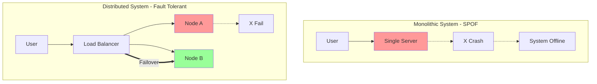

Imagine it's the day of your board exam results. You, along with millions of other students, log in to the result portal at 10:00 AM. The site crashes. That is an **Availability** failure.

In previous posts, we discussed [Throughput](/blogs/system-design/throughput-in-distributed-systems/) and [Latency](/blogs/system-design/latency-in-web-applications/). Today, we tackle the most critical aspect of any production system: **staying online**.

## Core Concepts

### 1. Availability
**Availability** is the percentage of time a system is operational and accessible to users. It's often measured in "nines":
*   **99%**: Down for 3.65 days/year.
*   **99.99% ("Four Nines")**: Down for 52 minutes/year.
*   **99.999% ("Five Nines")**: Down for 5 minutes/year.

### 2. Fault Tolerance
**Fault Tolerance** is the ability of a system to continue operating properly in the event of the failure of some of its components.
*   *Example*: If one engine of an airplane fails, the plane can still fly. The plane is Fault Tolerant.

### 3. Single Point of Failure (SPOF)
A part of a system that, if it fails, stops the entire system from working.

## Monoliths vs. Distributed Systems

The architectural choice you make dictates your system's survival strategy.

| Feature | Monolithic Architecture | Distributed System |
| :--- | :--- | :--- |
| **Structure** | All-in-one bundle | Modular, spread across nodes |
| **Failure Mode** | **SPOF**: If the server crashes, everything dies. | **Resilient**: If one node dies, others take over. |
| **Availability** | Low (Requires downtime for updates/crashes) | High (Zero-downtime deployments) |
| **Recovery** | Reboot the entire beast | Automatic failover |

## The Secret Sauce: Replication

How do distributed systems achieve high availability? **Redundancy**.

We don't just rely on one server. We **Replicate** everything.
1.  **Application Replication**: Run the same code on 10 different servers. If 3 crash, 7 are still running.
2.  **Data Replication**: Store your user data on a primary database and sync it to a standby replica. If the primary burns down, the standby takes over.
3.  **Geographic Replication**: Don't put all servers in one data center. If the entire underlying power grid of a region fails, your app typically keeps running from a different region.

### The ACID Trade-off
In databases, replication introduces complexity. If you write data to Node A, it takes time to copy to Node B. This touches on the **CAP Theorem** (Consistency vs. Availability), which we will cover in depth later.

## Real-Life Examples

### 1. Amazon Shopping (Prime Day)
On Prime Day, traffic spikes 100x. Amazon uses thousands of microservices distributed across the globe. If the "Reviews" service crashes, you can still buy items. The system degrades gracefully rather than failing completely.

### 2. Google Search
Google indexes the web across thousands of machines. If the specific server holding the index for "SpaceX" fails, a replica immediately answers your query. You, the user, never know a failure occurred.

## Conclusion

**Monoliths put all eggs in one basket.** If that basket drops, you have a mess.
**Distributed Systems** accept that failure is inevitable. Hard drives die, networks cut out, and power fails. By designing with **Fault Tolerance** and **Replication** in mind, we build systems that can survive the chaos of the real world.
