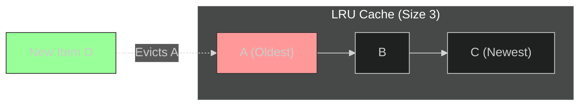

Cache memory (RAM) is fast but limited. Eventually, it gets full.
When you need to store new data but the cache is full, you must delete old data. This is **Cache Eviction**.

## The Concept: Time-to-Live (TTL)

Even if the cache isn't full, data shouldn't live forever.
**Time-to-Live (TTL)** is a setting that automatically deletes data after a certain period (e.g., 5 minutes, 1 hour).

### The Netflix Example
Netflix used to cache subscription plans with a **10-year TTL**.
*   **Problem**: When they changed from 4 plans to 5 plans, users still saw the old 4 plans because the cache never expired.
*   **Fix**: They reduced the TTL to hours/days to ensure users see updates.

## Eviction Algorithms

When the cache is full, how do we decide who gets kicked out?

### 1. Least Recently Used (LRU)
**"If you haven't used it in a while, you probably won't use it soon."**
*   **How it works**: Removes the item that was accessed *longest ago*.
*   **Use Case**: Most common strategy. Good for social media feeds (recent posts are hot, old posts are cold).

### 2. Least Frequently Used (LFU)
**"If you rarely use it, get rid of it."**
*   **How it works**: Tracks how *often* an item is accessed. Removes the one with the lowest count.
*   **Use Case**: Netflix (Bollywood movies might be less watched than Hollywood blockbusters globally, so Bollywood gets evicted first in US servers).

### 3. First In First Out (FIFO)
**"Oldest data leaves first."**
*   **How it works**: A simple queue. First item added is the first one deleted.
*   **Use Case**: Time-series data logs.

### 4. Most Recently Used (MRU)
**"Delete the newest item."**
*   **Use Case**: Rare. Example: "Tinder" (you don't want to see the same person you just swiped on again).

### 5. Random Replacement
**"Just delete something."**
*   **Use Case**: When you don't care or want to avoid overhead.

## Strategy Comparison

| Strategy | Description | Best For |
| :--- | :--- | :--- |
| **LRU** | Remove oldest *access* | General purpose, Social Media |
| **LFU** | Remove lowest *frequency* | Content Distribution (Netflix, YouTube) |
| **FIFO** | Remove oldest *insertion* | Logs, Queues |
| **MRU** | Remove newest *access* | Specific looping scenarios |
| **Random** | Remove random item | Low overhead needed |

## Conclusion

There is no "perfect" strategy.
*   For most web apps, **LRU** is the safe default.
*   For content platforms (Netflix), **LFU** might be better to keep popular content hot.
