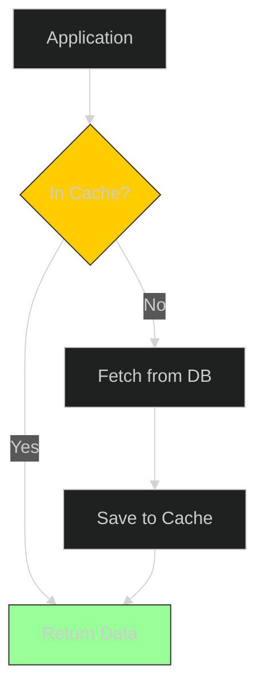

**Latency** kills user experience. If your app takes 3 seconds to load, users leave.
The database is often the bottleneck. The solution? **Don't ask the database.**

## What is Caching?

Caching is storing frequently accessed data in a temporary storage location (usually RAM) so that future requests can be served faster.

*   **Database (Disk)**: Slow. Doing a complex SQL join takes time.
*   **Cache (RAM)**: Fast. Reading from memory takes microseconds.

## How it Works: Cache Hit vs. Miss

1.  **Request**: App asks for `User:123`.
2.  **Cache Check**: Is `User:123` in Redis?
    *   **Yes (Cache Hit)**: Return data immediately. **Fast.**
    *   **No (Cache Miss)**: Fetch from DB, save to Cache, then return data. **Slow (once).**

## Real-World Examples

*   **Netflix**: Movie metadata (descriptions, actors) rarely changes. It's cached globally.
*   **Instagram**: Your profile info (bio, follower count) is cached. When you edit your profile, the cache is invalidated (cleared).
*   **Google**: Search results for common queries ("Facebook", "Weather") are served from cache.

## Types of Caching

### 1. In-Memory Cache (Local)
Stored on the server's own RAM.
*   **Pros**: Fastest (no network call).
*   **Cons**: If server restarts, data is lost. Not shared between servers.
*   **Tool**: `Guava`, `Caffeine`.

### 2. Distributed Cache (Shared)
A separate cluster of servers dedicated to caching.
*   **Pros**: Shared across all application servers. Persistent. Scalable.
*   **Cons**: Network call needed (slightly slower than local).
*   **Tool**: **Redis**, **Memcached**.

### 3. Content Delivery Network (CDN)
Geographically distributed servers that cache static assets (images, CSS, JS, Videos).
*   **Pros**: Serves content from a server close to the user (e.g., a London user gets data from a London server).
*   **Tool**: **Cloudflare**, **AWS CloudFront**.

## Caching Strategy Cheat Sheet

| Type | Best For | Example Tool |
| :--- | :--- | :--- |
| **Local Cache** | Session data, heavy computations | Caffeine |
| **Distributed Cache** | Database queries, API responses | Redis |
| **CDN** | Images, Videos, HTML, CSS | Cloudflare |

## Cache Invalidation: The Hard Part

Data in the database changes. If the cache still has the old data, users see **stale content**.
How do we fix this?

1.  **Time-to-Live (TTL)**: Automatically delete data after a set time (e.g., 5 minutes). Good for news feeds or weather.
2.  **Manual Invalidation**: Explicitly delete the cache when data changes (e.g., when a user updates their profile).

## Conclusion

Caching is the easiest way to scale a read-heavy system.
*   **Effect**: Reduces load on the database.
*   **Trade-off**: Complexity in invalidation ("There are only two hard things in Computer Science: cache invalidation and naming things.").
