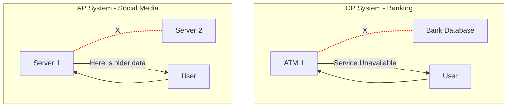

In distributed systems, there is no free lunch. The **CAP Theorem** (Brewer's Theorem) states that a distributed data store can effectively provide only **two** of the following three guarantees:

1.  **Consistency (C)**
2.  **Availability (A)**
3.  **Partition Tolerance (P)**

## The Three Pillars

### 1. Consistency (C)
**Every read receives the most recent write or an error.**
*   *Analogy*: If you update your status on Facebook on your phone, your friend on their laptop should see the new status immediately. If they see the old one, the system is **Inconsistent**.

### 2. Availability (A)
**Every request receives a (non-error) response, without the guarantee that it contains the most recent write.**
*   *Analogy*: Even if the network is flaky, Amazon should allow you to add items to your cart. It’s better to sell the item and sync later than to show a "System Offline" error.

### 3. Partition Tolerance (P)
**The system continues to operate despite an arbitrary number of messages being dropped or delayed by the network between nodes.**
*   *Analogy*: If the cable connecting the US and Europe servers is cut, the system should still work.

## The Reality: P is Not Optional

In a Distributed System, network failures (Partitions) are inevitable. You cannot choose "CA" (Consistency + Availability) because that implies your network will never fail, which is impossible.

**Therefore, the real choice is between CP and AP.**

### CP (Consistency + Partition Tolerance)
*   **Philosophy**: "Better to return Error than Wrong Data."
*   **Behavior**: When a partition occurs, the system stops accepting writes to preserve consistency.
*   **Use Case**: **Banking**, **ATM**. You cannot allow two peole to withdraw the same $100 if the ATMs lose connection. The ATM simply says "Out of Service" (Sacrificing Availability).

### AP (Availability + Partition Tolerance)
*   **Philosophy**: "The Show Must Go On."
*   **Behavior**: When a partition occurs, nodes continue to accept writes and serve stale data. They sync up when the partition heals.
*   **Use Case**: **Social Media**, **Shopping Carts**. If Instagram cannot sync your latest photo globally, it will still show your profile. It stays Available, even if Inconsistent.

## Summary Table

| Choice | Trade-off | Example |
| :--- | :--- | :--- |
| **CA** | No Partition Tolerance | **RDBMS (MySQL)** (Single Node) |
| **CP** | Sacrifice Availability | **MongoDB, HMAC** (Banking) |
| **AP** | Sacrifice Consistency | **Cassandra, DynamoDB** (Social Media) |

## Conclusion

The CAP Theorem forces you to decide what matters more to your business. 
*   If losing a transaction means legal trouble (Money), choose **CP**.
*   If downtime means losing customers (Retail/Social), choose **AP**.

There is no "best" architecture, only the right one for your specific problem.
