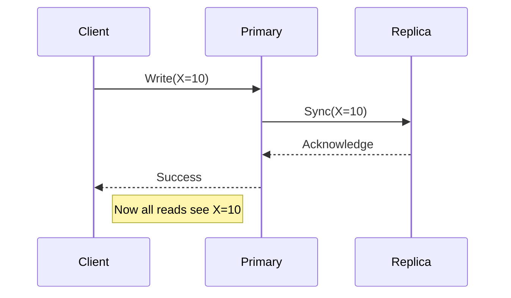

In our last post on [Availability](/blogs/system-design/availability-and-fault-tolerance/), we saw that **Replication** is key to keeping systems alive. But Replication introduces a new problem: **Consistency**.

If you have two copies of a database, and you update one, the other is instantly "stale." Ideally, both would update instantly, but in the real world, that takes time.

## What is Consistency?

**Consistency** means that every read receives the most recent write or an error. In simple terms: **All clients see the same data at the same time.**

### Real-Life Example: The ATM Problem
Imagine you have $500 in your bank account.
1.  **You** withdraw $500 from an ATM in Delhi.
2.  **Your Spouse** simultaneously tries to withdraw $500 from an ATM in Pune.

In a **Consistent** system, the second transaction fails because the balance is $0.
In an **Inconsistent** system, both transactions might succeed, and the bank loses money.

## Monoliths vs. Distributed Systems

| System Type | Consistency Level | Why? |
| :--- | :--- | :--- |
| **Monolithic** | **Naturally High** | Single database (Source of Truth). No sync needed. |
| **Distributed** | **Hard to Maintain** | Data is spread across nodes. Sync takes time (Network Latency). |

## Types of Consistency Models

In distributed systems, you often have to choose between speed and accuracy.

### 1. Strong Consistency
*   **Definition**: Once a write is successful, **all** subsequent reads return the new value.
*   **Mechanism**: The system locks data during updates. Read operations wait until all replicas acknowledge the update.
*   **Trade-off**: Higher Latency (slower).
*   **Use Case**: **Banking Systems**, **Stock Trading**, **Train Ticket Booking** (IRCTC). You cannot sell the same seat twice.

### 2. Eventual Consistency
*   **Definition**: If no new updates are made, **eventually** all accesses will return the last updated value.
*   **Mechanism**: The system returns "Success" to the client immediately after updating the primary node. Replicas update in the background.
*   **Trade-off**: Lower Latency (faster), but risk of stale data.
*   **Use Case**: **Social Media Feeds** (Instagram/Twitter). If you change your profile picture, it’s okay if your friend sees the old one for a few more seconds.

### 3. Weak Consistency
*   **Definition**: There is no guarantee that a read will return the most recent write. It relies on "best effort."
*   **Use Case**: **Live Video Streaming**, **VoIP**. If you miss a frame of video, it’s gone. The system doesn't pause to sync.

## How to Improve Consistency

1.  **Stop Read Operations**: During a major update, put the system in "Maintenance Mode." (Brute force approach).
2.  **Reduce Replica Distance**: Place replicas closer to each other to minimize sync time.
3.  **Application Coordination**: Use consensus algorithms like **Paxos** or **Raft** (used in Kubernetes/Etcd) to ensure nodes agree on the truth.

## Conclusion

Consistency is a spectrum.
*   Need **Accuracy**? Choose **Strong Consistency** (but accept slower performance).
*   Need **Speed**? Choose **Eventual Consistency** (but accept temporary staleness).

As a system architect, your job is to know which part of your app needs which model. Billing must be Strong; Recommendations can be Eventual.
