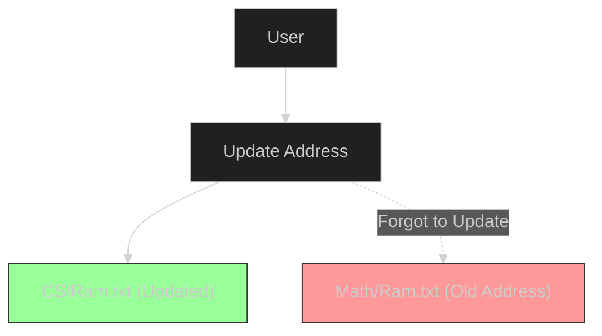

Before databases (DBMS) ruled the world, we had **File-Based Storage Systems**.
Essentially, data was stored in folders and text files. While simple, it falls apart quickly at scale.

## What is a File-Based System?
Imagine storing college student records in a folder structure:
*   `Folder: Computer Science` -> `File: Ram.txt`
*   `Folder: Electrical Engineering` -> `File: Shyam.txt`

## The 4 Major Challenges

### 1. Data Redundancy
The same data is stored in multiple places.
*   **Example**: "Ram" takes both CS and Math classes. His address is stored in `CS/Ram.txt` AND `Math/Ram.txt`.
*   **Result**: Wasted storage.

### 2. Data Inconsistency
Since data is duplicated, updates might fail on one copy.
*   **Scenario**: Ram moves to a new house. You update `CS/Ram.txt` but forget `Math/Ram.txt`.
*   **Result**: The system has two different addresses for the same person. Which one is true?

### 3. Security Issues
It's hard to control granular access.
*   **Scenario**: You want a professor to see Ram's *grades* but not his *home address*.
*   **Problem**: In a file system, if you give read access to the file, they see everything. You can't easily hide specific "columns".

### 4. Slow Data Access
No indexing.
*   **Scenario**: "Find all students with GPA > 3.5".
*   **Problem**: You have to open *every single file* and check. This is incredibly slow compared to a SQL query.

## Conclusion

File-based systems are fine for simple, personal data.
But for any application with multiple users and relationships, you need a **Relational Database Management System (RDBMS)** to handle Consistency, Security, and Speed.
