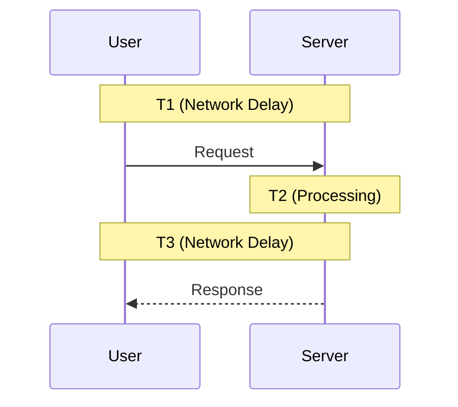

Speed is a feature. In system design, **Latency** is the villain we are constantly fighting.

In the previous post, we discussed [Distributed Systems](/blogs/system-design/distributed-systems/), which provide scalability at the cost of complexity. One of the biggest costs? **Latency**.

In this post, we'll dissect what latency actually is, why modern distributed architectures often make it worse, and the three main weapons we have to fight it.

## What is Latency?

**Latency** is the time it takes for a data packet to travel from one point to another. In the context of a web application, it's the round-trip time from the user's action to the application's response.

### The Formula: T1 + T2 + T3

We can break down latency into three distinct phases:

1.  **T1 (Network Delay - Request)**: Time for the request to travel from User → Server.
2.  **T2 (Processing Delay - Computer)**: Time the server takes to think and process the request.
3.  **T3 (Network Delay - Response)**: Time for the response to travel from Server → User.

\[ \text{Total Latency} = T1 + T2 + T3 \]

## Architecture Impact: Monolith vs. Distributed

You might think that upgrading to a "modern" Distributed System (microservices) would make your app faster. **Often, it does the opposite.**

### Monolithic Architecture (Low Latency)
In a monolith, function calls are strictly **in-memory**. When the `OrderService` needs to check the `InventoryService`, it's just a function call.
*   **Latency Profile**: Extremely low network overhead. Mostly T2 (Processing).

### Distributed Architecture (High Latency)
In a distributed system, that same check is now an **HTTP request over the network**.
*   **Latency Profile**: Every internal communication adds a new T1 + T3 round trip.

| Architecture | Processing Delay (T2) | Network Delay (T1 + T3) | Overall Latency |
| :--- | :--- | :--- | :--- |
| **Monolithic** | Standard | Minimal (External only) | **Low** |
| **Distributed** | Standard | High (Internal + External) | **High** |

## How to Reduce Latency

Since we can't change the speed of Network (T1/T3) or make CPUs infinitely fast (T2), we use architectural patterns.

### 1. Caching (Reducing T2)
If your application takes 500ms to calculate a report (T2), doing it every time is wasteful. **Caching** stores the result so the next request takes 5ms.
*   **Real-Life Example**: **Twitter/X**. When you load your timeline, Twitter doesn't query the database for every tweet. It pulls a pre-computed list from a Redis cache, making the load time instant.

### 2. Content Delivery Network - CDN (Reducing T1 + T3)
If your server is in New York and your user is in Tokyo, T1 and T3 will be high because of physical distance. A **CDN** stores copies of your static files (images, CSS, JS) on servers all over the world.
*   **Real-Life Example**: **Instagram**. The photos you see aren't coming from a main server in the US; they are being served from a CDN edge location in your own city.

### 3. Hardware Scaling (Reducing T2)
Sometimes, the simplest solution is brute force. upgrading the CPU, RAM, or using faster SSDs can significantly reduce processing time.
*   **Benefit**: Easy to implement.
*   **Downside**: Expensive and has limits (Vertical Scaling limit).

## Conclusion

Latency is the silent killer of user experience. While distributed systems offer scalability, they introduce network latency that must be managed. By understanding the **T1+T2+T3** formula and aggressively using **Caching** and **CDNs**, you can build systems that feel instant to your users.
