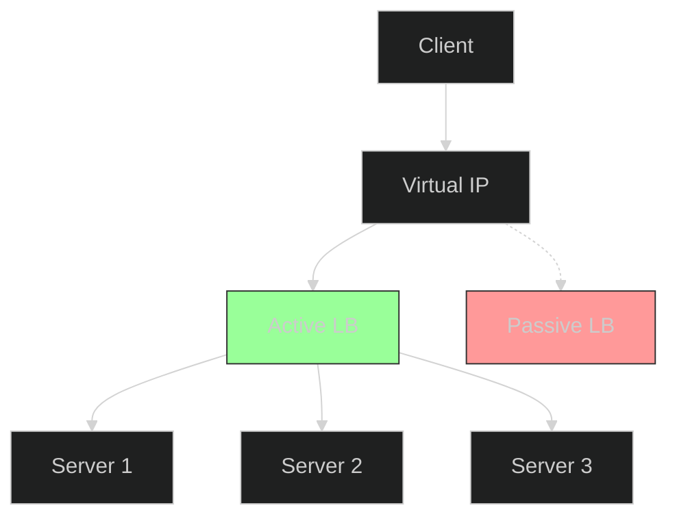

When you have multiple servers (Horizontal Scaling), you need a way to distribute traffic among them. Enter the **Load Balancer (LB)**.

A Load Balancer acts as the entry point to your system. It accepts requests from clients and routes them to the appropriate backend server.

## Core Concepts

### 1. Virtual IP (VIP)
Clients don't talk to individual servers (IP1, IP2). They talk to the **VIP** of the Load Balancer. The LB then forwards the request internally.

### 2. Health Checks
The LB constantly pings your servers ("Are you alive?"). If a server crashes, the LB stops sending traffic to it. This ensures **High Availability**.

### 3. High Availability (HA) for the LB itself
If the LB crashes, your whole site goes down. To prevent this, we use **Redundancy** (Active-Passive LB setup).

## Load Balancing Algorithms

How does the LB decide which server gets the next request?

| Algorithm | Description | Use Case |
| :--- | :--- | :--- |
| **Round Robin** | Cyclic order (S1 -> S2 -> S3 -> S1). Simple. | Servers with equal specs. |
| **Weighted Round Robin** | Assigns more requests to powerful servers. | Heterogeneous fleet (some big, some small servers). |
| **Least Connections** | Sends to the server with fewest active connections. | Long-lived connections (e.g., WebSocket, Chat). |
| **Least Response Time** | Sends to the fastest responding server. | Performance-sensitive apps. |
| **IP Hash** | Hashes Client IP to map to a specific server. | **Session Stickiness** (Ensure User A always goes to Server 1). |

## Timeline of a Request

1.  **Client** sends request to `api.example.com` (VIP).
2.  **LB** receives request.
3.  **LB** checks **Health Status** of backend pool.
4.  **LB** selects a server using an **Algorithm** (e.g., Round Robin).
5.  **LB** forwards request to `Server 2`.
6.  `Server 2` processes and responds.

## Conclusion

Load Balancers are essential for scaling. They provide:
*   **Scalability**: Add servers seamlessly.
*   **Availability**: Automatically bypass dead servers.
*   **Flexibility**: Perform maintenance on servers without downtime.

However, remember that the LB itself can be a bottleneck or a single point of failure if not configured with redundancy.
