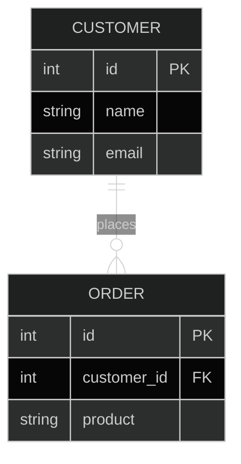

The step up from a File-Based System is the **Relational Database Management System (RDBMS)**.
Examples: **MySQL, PostgreSQL, Oracle, SQL Server**.

Instead of loose files, data is stored in **Tables** with strict structures.

## Core Concepts

*   **Tables**: Like Excel sheets (Rows & Columns).
*   **Relationships**: Tables are linked via **Foreign Keys**.
*   **Schema**: The structure is fixed. You must define columns (e.g., `Age` is an Integer) upfront.

## Why RDBMS Wins (vs. Files)

### 1. No Redundancy
Data is normalized.
*   **Customer Table**: Stores Name & Address once.
*   **Order Table**: Links to Customer ID.
If the customer moves, you update the address in **one place**.

### 2. Consistency & Integrity
RDBMS enforces rules.
*   **Constraints**: You can't enter "Hello" into an `Age` column.
*   **ACID Properties**: Transactions are "All or Nothing". If money leaves Account A but fails to reach Account B, the entire transaction rolls back.

### 3. Powerful Querying (SQL)
Instead of writing a script to open 1,000 files, you write:
```sql
SELECT * FROM Students WHERE GPA > 3.5;
```



## The Limitations

RDBMS is great, but it has flaws.

### 1. Rigid Schema
Changing the structure is hard.
*   **Scenario**: You want to add a "GitHub Profile" column to the User table.
*   **Problem**: You have to run an `ALTER TABLE` command, which can lock the database and cause downtime for millions of rows.

### 2. Scalability Issues
RDBMS is designed for **Vertical Scaling** (Bigger Server).
**Horizontal Scaling (Sharding)** is very difficult because relationships (JOINs) heavily limit how you can split data across servers.

## Comparison

| Feature | File System | RDBMS |
| :--- | :--- | :--- |
| **Structure** | Unstructured Files | Structured Tables |
| **Redundancy** | High (Duplicate data) | Low (Normalization) |
| **Consistency** | Risk of mismatch | Enforced (ACID) |
| **Querying** | Manual Parsing | SQL |
| **Scaling** | Hard | Vertical (Good), Horizontal (Hard) |

## Conclusion

RDBMS is the industry standard for a reason. It provides safety and structure.
However, when you need massive scale or flexible data structures, you might hit a wall. That's where **NoSQL** comes in (stay tuned!).
