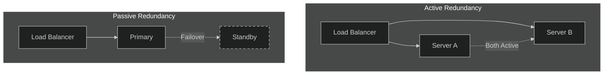
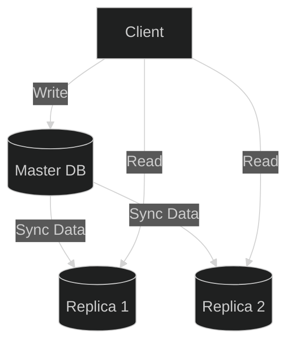

These two terms are often used interchangeably, but in System Design, they mean very different things.

*   **Redundancy**: "I have a spare tire."
*   **Replication**: "I have a spare tire, and it has the exact same air pressure and tread wear as the main tire."

## 1. Redundancy (The Survival Strategy)

**Redundancy** is simply the duplication of components to increase reliability. Ideally, it's about **Availability**.
It does **not** imply that the components share state or data.

*   **Example**: You have two web servers running the same code. If Server A dies, Server B takes over. Since the code is static, you don't need to "sync" anything in real-time.

### Types of Redundancy
*   **Active Redundancy**: All nodes are active and sharing the load (e.g., behind a Load Balancer).
*   **Passive Redundancy**: One node is active, the others are on standby (Cold Standby).

## 2. Replication (The Data Strategy)

**Replication** is Redundancy **+ Synchronization**.
It is used for **Data** (Databases, Caches) where state changes over time. You can't just have a specific "backup" DB; that backup must have the *latest* data.

*   **Example**: You have a Primary Database and a Replica. When you write `User.name = "Alice"` to the Primary, that change must be **Replicated** to the Replica.

### Types of Replication
*   **Active Replication (Multi-Master)**: You can write to any node, and they sync with each other. Complex conflict resolution needed.
*   **Passive Replication (Master-Slave)**: You write only to the Master. The Master syncs to Slaves. Slaves are Read-Only (usually).

## Comparison Cheat Sheet

| Feature | Redundancy | Replication |
| :--- | :--- | :--- |
| **Goal** | **Availability** (Survive failure) | **Consistency** (Keep data in sync) |
| **Sync Needed?** | No (Usually stateless) | **Yes** (Critical) |
| **Use Case** | Web Servers, Power Supplies, Network Cables | Databases, Caches, File Storage |
| **Complexity** | Low | High (Handling lag, conflicts) |

## Conclusion

*   Use **Redundancy** to keep your application running (Stateless).
*   Use **Replication** to keep your data safe and consistent (Stateful).
