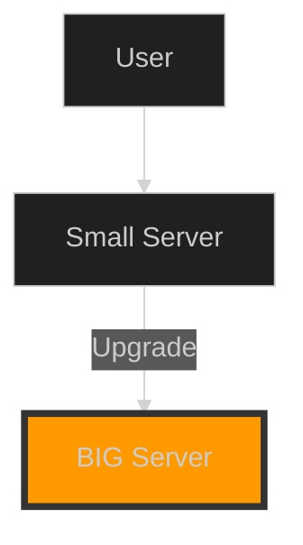
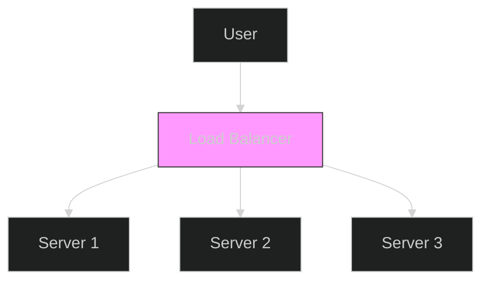

When your app goes viral, your server will crash. To fix this, you have two choices:
1.  Make your existing server stronger (**Vertical Scaling**).
2.  Add more servers to share the load (**Horizontal Scaling**).

## What is Scalability?
**Scalability** is a system's ability to handle an increased load without degraded performance.

## 1. Vertical Scaling (Scale Up)
You upgrade the existing machine. You add more RAM, a faster CPU, or a bigger SSD.

*   **Analogy**: Your car is too slow, so you replace the engine with a Ferrari engine. It's still one car, but much faster.
*   **Pros**: Simple. No code changes required. Lower management overhead.
*   **Cons**: Expensive. Has a hard limit (you can't upgrade forever). **Single Point of Failure**.

## 2. Horizontal Scaling (Scale Out)
You add more machines to your pool of resources.

*   **Analogy**: Your car can't carry enough people, so you buy a second car (and a third, and a fourth).
*   **Pros**: Infinite scaling. Cheaper hardware. **High Availability**.
*   **Cons**: Complex. Requires Load Balancers. Data consistency challenges.

## Comparisons

| Feature | Vertical Scaling (Scale Up) | Horizontal Scaling (Scale Out) |
| :--- | :--- | :--- |
| **Complexity** | Low (Easy) | High (Hard) |
| **Cost** | High (Premium Hardware) | Low (Commodity Hardware) |
| **Limit** | Hard Hardware Limit | Theoretically Unlimited |
| **Failover** | Single Point of Failure | Resilient (Redundancy) |
| **Downtime** | Required for upgrades | Zero downtime upgrades |

## Conclusion

*   Start with **Vertical Scaling** for simplicity (Monoliths).
*   Switch to **Horizontal Scaling** when you need reliability and massive scale (Distributed Systems).
