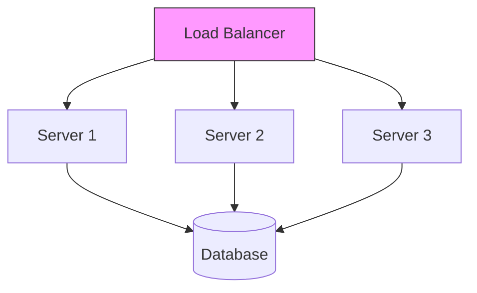

In our previous discussions, we covered [Monoliths](/blogs/system-design/monolithic-architecture/), [Distributed Systems](/blogs/system-design/distributed-systems/), and [Latency](/blogs/system-design/latency-in-web-applications/).

Today, we decode **Throughput** (often measured in bits per second, bps)—the measure of how much work your system can actually handle. While Latency is about "speed," Throughput is about "capacity."

## What is Throughput?

**Throughput** is the amount of work (requests, data, transactions) a system can process in a given unit of time.

*   **Latency**: How long does it take to move *one* car from A to B?
*   **Throughput**: How many cars *per hour* can move from A to B?

Ideally, you want **High Throughput** and **Low Latency**. However, improving one can sometimes hurt the other.

## Throughput: Monolithic vs. Distributed

| Feature | Monolithic System | Distributed System |
| :--- | :--- | :--- |
| **Resources** | Limited to one machine (CPU/RAM cap) | Virtually unlimited (Add more machines) |
| **Scaling** | Vertical (Expensive, Hard limit) | Horizontal (Add nodes endlessly) |
| **Throughput** | **Low/Capped** | **High/Uncapped** |
| **Bottleneck** | The single server itself | Network bandwidth or Database |

### Why Distributed Systems Win on Throughput

In a Monolith, your throughput is hard-capped by the physical limits of the server. If your server can handle 1,000 requests/sec, that's it.

In a Distributed System, you can use **Horizontal Scaling**. If one server handles 1,000 req/sec, ten servers handle 10,000 req/sec.

*By adding Servers (S1, S2, S3...), you increase the total throughput of the system linearly.*

## What Kills Throughput?

Even in distributed systems, throughput isn't infinite. Three main factors drag it down:

1.  **Latency**: If each request takes longer to process (high latency), the server is busy for longer, reducing the number of requests it can handle per second.
2.  **Protocol Overhead**: Every network call involves handshakes (TCP/TLS) and headers. This "administrative" data consumes bandwidth that could be used for actual payload.
3.  **Congestion**: When too many requests arrive at once, queues fill up. Packets get dropped, causing retries, which further clogs the system.

## Strategies to Maximize Throughput

To get the most out of your distributed system, you need to optimize the flow of data.

### 1. Load Balancing
A **Load Balancer** sits in front of your servers and distributes traffic evenly (e.g., Round Robin). This ensures no single server is overwhelmed while others sit idle.

### 2. Caching & CDNs
Serving data from a cache or [CDN](/blogs/system-design/latency-in-web-applications/) avoids hitting the backend servers entirely.
*   **Real-Life Example**: **Netflix**. By serving video chunks from a local ISP server (CDN), they offload terabytes of data from their main servers, massively increasing global throughput.

### 3. Asynchronous Processing
Instead of blocking a connection while waiting for a task to finish, use message queues (like Kafka). The system accepts the request immediately (improving throughput) and processes it in the background.

## Real-Life Example: Ticket Booking vs. Video Streaming

*   **Ticket Booking (IRCTC/Ticketmaster)**: Low Throughput, High Consistency requirement. The bottleneck is the database lock (selling the same seat twice).
*   **Video Streaming (YouTube)**: High Throughput requirement. The system needs to push gigabytes of data per second to millions of users. It relies heavily on CDNs and distributed storage to achieve this massive throughput.

## Conclusion

Throughput is the capacity of your system. While Monoliths are limited by single-machine physics, Distributed Systems unlock massive throughput via Horizontal Scaling. By managing **Congestion** and using **Load Balancers**, you can build systems that handle millions of users effortlessly.
