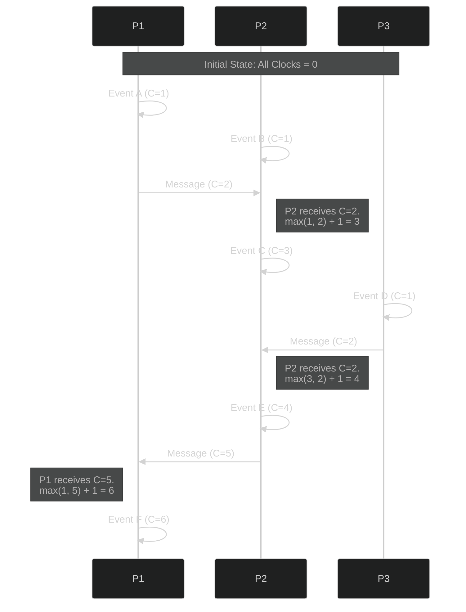

In a Monolithic system, "Time" is easy. You ask the OS for `Date.now()`, and that is the absolute truth.
In a Distributed System, "Time" is a nightmare.

Common questions like "Which event happened first?" become remarkably hard to answer.

## The Problem with Physical Clocks

Distributed systems span different machines, often in different time zones (e.g., US, India, Australia). Each machine has its own **Physical Clock**.
Even with NTP (Network Time Protocol), these clocks drift. One server might think it's `10:00:00.001` while another thinks it's `10:00:00.005`.

This **Clock Skew** means you cannot rely on timestamps to order events.
*   **Scenario**: User A books a ticket at `10:00:01` (Server US). User B books the same ticket at `10:00:02` (Server India). If the India server's clock is 5 seconds slow, it might record the time as `09:59:57`, making it look like User B booked it first!

## Ideally: Partial Ordering

We don't need to know the *exact* time. We just need to know the **Order of Events**.
This is called the **Happened-Before Relationship**.

## The Solution: Lamport Logical Clocks

Leslie Lamport introduced a simple algorithm to solve this using **Logical Counters** instead of real time.

### The Algorithm

Every process maintains a counter `C`, initially `0`.

1.  **Internal Event**: Before executing an event, increment `C = C + 1`.
2.  **Send Message**: Increment `C = C + 1` and send `C` along with the message.
3.  **Receive Message**: When receiving a message with counter `C_msg`, update your local counter: `C = max(C, C_msg) + 1`.

### Visualizing the Flow

Let's look at three processes (P1, P2, P3) interacting. Notice how P2's clock jumps forward when it receives a message from P3.

### What This Tells Us

*   If event `A` caused event `B`, then `Clock(A) < Clock(B)`.
*   This gives us a **Partial Ordering** of events.
*   It does **not** give us real time (duration), but it ensures causality is respected.

## Conclusion

In Distributed Systems, **Logical Time > Physical Time**.
Tools like **Lamport Clocks** and **Vector Clocks** (an immense improvement on Lamport) are the bedrock of systems like Amazon Dynamo, Cassandra, and Google Spanner. They allow us to agree on the sequence of events without needing atomic clocks in every server.
